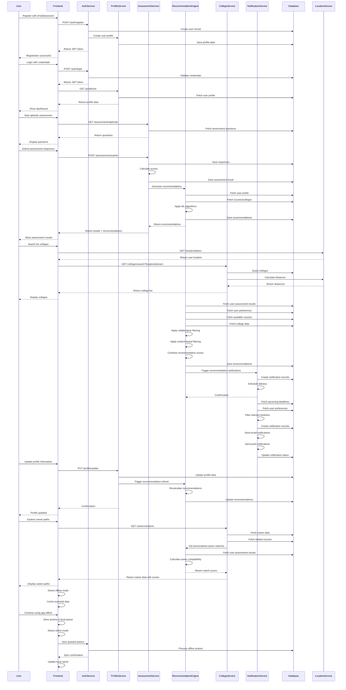

# Digital Guidance Platform - System Design Document

## Implementation Approach

We will build a scalable, modern web application using a microservices architecture with React.js frontend and Node.js backend. The system will leverage Shadcn-ui components with TypeScript and Tailwind CSS for a responsive, accessible interface. Key technical decisions include:

### Architecture Decisions
- **Frontend**: React.js with TypeScript, Shadcn-ui component library, Tailwind CSS for styling
- **Backend**: Node.js with Express.js, microservices architecture for scalability
- **Database**: PostgreSQL for relational data, Redis for caching, MongoDB for analytics
- **AI/ML**: Python-based recommendation engine with scikit-learn and TensorFlow
- **Real-time**: WebSocket connections for notifications and live updates
- **Mobile**: Progressive Web App (PWA) approach for mobile responsiveness
- **Offline**: Service Workers for offline functionality and data synchronization

### Key Technical Challenges
1. **Recommendation Engine**: Implementing ML algorithms for personalized course and college suggestions
2. **Real-time Data Sync**: Ensuring college information, deadlines, and notifications are always current
3. **Scalability**: Supporting potential national rollout with millions of users
4. **Offline Capability**: Providing core functionality in areas with poor internet connectivity
5. **Multi-language Support**: Adapting to regional languages and education systems

## Data Structures and Interfaces

```mermaid
classDiagram
    class User {
        +string id
        +string email
        +string password_hash
        +string first_name
        +string last_name
        +Date date_of_birth
        +string phone
        +string current_class
        +string state
        +string district
        +string preferred_language
        +UserProfile profile
        +Date created_at
        +Date updated_at
        +__init__(email: string, password: string)
        +authenticate(password: string) boolean
        +update_profile(data: object) void
        +get_recommendations() List[Recommendation]
    }

    class UserProfile {
        +string user_id
        +string academic_stream
        +List[string] interests
        +object assessment_results
        +List[string] preferred_subjects
        +string career_goals
        +string family_income_range
        +boolean first_generation_learner
        +object location_preferences
        +Date last_updated
        +update_interests(interests: List[string]) void
        +set_career_goals(goals: string) void
        +get_profile_completeness() number
    }

    class Assessment {
        +string id
        +string title
        +string type
        +string description
        +List[Question] questions
        +object scoring_algorithm
        +number duration_minutes
        +boolean is_active
        +Date created_at
        +__init__(title: string, type: string)
        +add_question(question: Question) void
        +calculate_score(responses: List[Response]) AssessmentResult
        +get_recommendations(result: AssessmentResult) List[Recommendation]
    }

    class Question {
        +string id
        +string assessment_id
        +string question_text
        +string question_type
        +List[Option] options
        +object validation_rules
        +number order_index
        +boolean is_required
        +__init__(text: string, type: string)
        +validate_response(response: any) boolean
        +get_scoring_weight() number
    }

    class Option {
        +string id
        +string question_id
        +string option_text
        +number score_value
        +string category
        +number order_index
        +__init__(text: string, value: number)
    }

    class AssessmentResult {
        +string id
        +string user_id
        +string assessment_id
        +object responses
        +object calculated_scores
        +object personality_traits
        +List[string] recommended_streams
        +List[string] career_matches
        +Date completed_at
        +__init__(user_id: string, assessment_id: string)
        +calculate_compatibility(career: Career) number
        +get_top_recommendations(limit: number) List[Recommendation]
        +export_report() object
    }

    class College {
        +string id
        +string name
        +string type
        +string state
        +string district
        +string city
        +object location_coordinates
        +List[Course] courses
        +object facilities
        +object admission_criteria
        +object fee_structure
        +object placement_statistics
        +string accreditation
        +number ranking
        +List[string] photos
        +Date last_updated
        +__init__(name: string, location: object)
        +add_course(course: Course) void
        +update_admission_info(info: object) void
        +get_courses_by_stream(stream: string) List[Course]
        +calculate_distance(user_location: object) number
    }

    class Course {
        +string id
        +string college_id
        +string name
        +string degree_type
        +string stream
        +string specialization
        +number duration_years
        +object eligibility_criteria
        +object fee_details
        +number seats_available
        +object cutoff_scores
        +List[CareerPath] career_paths
        +string syllabus_url
        +Date last_updated
        +__init__(name: string, degree_type: string)
        +check_eligibility(user_profile: UserProfile) boolean
        +get_career_opportunities() List[Career]
        +calculate_roi() number
    }

    class Career {
        +string id
        +string title
        +string industry
        +string description
        +List[string] required_skills
        +object salary_range
        +object growth_prospects
        +List[string] education_paths
        +List[string] government_exams
        +List[string] private_opportunities
        +string entrepreneurship_potential
        +List[string] related_careers
        +Date last_updated
        +__init__(title: string, industry: string)
        +get_education_requirements() List[Course]
        +calculate_match_score(assessment_result: AssessmentResult) number
        +get_skill_gaps(user_profile: UserProfile) List[string]
    }

    class CareerPath {
        +string id
        +string course_id
        +string career_id
        +string path_description
        +List[string] milestones
        +object timeline
        +List[string] required_certifications
        +number success_probability
        +__init__(course_id: string, career_id: string)
        +get_recommended_steps() List[string]
        +calculate_duration() number
    }

    class Recommendation {
        +string id
        +string user_id
        +string type
        +string item_id
        +string title
        +string description
        +number confidence_score
        +object reasoning
        +string status
        +Date created_at
        +Date expires_at
        +__init__(user_id: string, type: string, item_id: string)
        +mark_viewed() void
        +mark_acted_upon() void
        +update_feedback(rating: number) void
    }

    class Timeline {
        +string id
        +string title
        +string description
        +string category
        +Date start_date
        +Date end_date
        +string state
        +string target_audience
        +string source_url
        +boolean is_recurring
        +string notification_schedule
        +Date created_at
        +__init__(title: string, start_date: Date, end_date: Date)
        +is_relevant_for_user(user: User) boolean
        +get_notification_times() List[Date]
        +mark_completed(user_id: string) void
    }

    class Notification {
        +string id
        +string user_id
        +string type
        +string title
        +string message
        +object data
        +string channel
        +boolean is_read
        +boolean is_sent
        +Date scheduled_at
        +Date sent_at
        +Date created_at
        +__init__(user_id: string, type: string, message: string)
        +mark_as_read() void
        +schedule_delivery(date: Date) void
        +send() boolean
    }

    class RecommendationEngine {
        +__init__()
        +train_model(data: List[object]) void
        +generate_course_recommendations(user: User) List[Recommendation]
        +generate_college_recommendations(user: User) List[Recommendation]
        +generate_career_recommendations(assessment_result: AssessmentResult) List[Recommendation]
        +update_user_preferences(user_id: string, feedback: object) void
        +calculate_similarity(user1: User, user2: User) number
        +get_trending_courses(location: string) List[Course]
    }

    class LocationService {
        +__init__()
        +get_user_location(ip_address: string) object
        +find_nearby_colleges(location: object, radius: number) List[College]
        +calculate_distance(point1: object, point2: object) number
        +get_state_districts(state: string) List[string]
        +validate_location(location: object) boolean
    }

    class NotificationService {
        +__init__()
        +send_email(notification: Notification) boolean
        +send_sms(notification: Notification) boolean
        +send_push_notification(notification: Notification) boolean
        +schedule_notification(notification: Notification) void
        +process_notification_queue() void
        +get_user_preferences(user_id: string) object
    }

    class AuthService {
        +__init__()
        +register_user(email: string, password: string, profile_data: object) User
        +authenticate_user(email: string, password: string) string
        +generate_jwt_token(user: User) string
        +validate_token(token: string) boolean
        +reset_password(email: string) boolean
        +update_password(user_id: string, old_password: string, new_password: string) boolean
    }

    %% Relationships
    User ||--|| UserProfile : has
    User ||--o{ AssessmentResult : takes
    User ||--o{ Recommendation : receives
    User ||--o{ Notification : gets
    
    Assessment ||--o{ Question : contains
    Question ||--o{ Option : has
    Assessment ||--o{ AssessmentResult : generates
    
    AssessmentResult ||--o{ Recommendation : creates
    
    College ||--o{ Course : offers
    Course ||--o{ CareerPath : leads_to
    Career ||--o{ CareerPath : accessible_via
    
    Timeline ||--o{ Notification : triggers
    
    RecommendationEngine ..> User : analyzes
    RecommendationEngine ..> Assessment : uses
    RecommendationEngine ..> College : recommends
    RecommendationEngine ..> Course : suggests
    
    LocationService ..> College : locates
    NotificationService ..> Notification : sends
    AuthService ..> User : manages
```

## Program Call Flow



## Anything UNCLEAR

Several aspects require clarification and further specification:

1. **Assessment Algorithm Validation**: The psychometric assessment algorithms need validation by educational psychologists. We need partnerships with certified career counseling organizations to ensure scientific accuracy.

2. **Real-time Data Sources**: Integration points for college admission data, cut-off scores, and deadline information need to be established with government education portals and individual institutions.

3. **Regional Customization**: The system needs adaptation for different state education boards, regional languages (Hindi, Tamil, Telugu, etc.), and local career opportunities. Translation and localization strategy requires definition.

4. **Offline Data Synchronization**: The extent of offline functionality needs specification - which features work offline, how much data to cache, and conflict resolution strategies for offline-online sync.

5. **Machine Learning Model Training**: Initial training data sources for the recommendation engine need identification. We need historical student success data, career outcome information, and user behavior patterns.

6. **Scalability Thresholds**: Specific performance requirements for national rollout (concurrent users, response times, data volume) need definition to guide infrastructure decisions.

7. **Privacy and Data Protection**: Compliance requirements for handling minor's data, parental consent mechanisms, and data retention policies need legal review and implementation guidelines.

8. **Integration APIs**: Technical specifications for integrating with government portals (NIRF, UGC), scholarship databases, and college admission systems require detailed API documentation.

9. **Success Metrics Tracking**: Implementation details for measuring the 25% government college enrollment increase and other KPIs need tracking mechanisms and attribution models.

10. **Content Management**: Processes for updating college information, career data, and assessment content need workflow definition and quality assurance procedures.