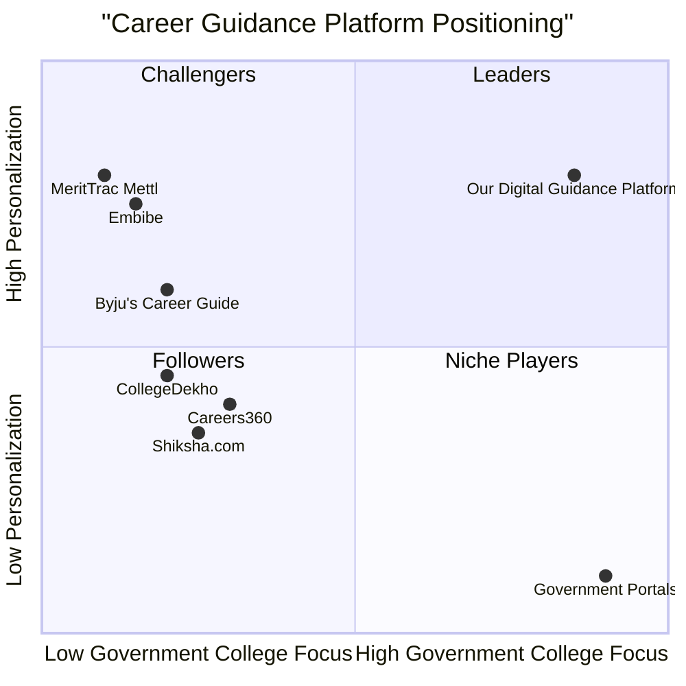

# Digital Guidance Platform - Product Requirements Document (PRD)

## 1. Language & Project Information

**Language:** English  
**Programming Language:** TypeScript, React.js, Node.js, Tailwind CSS  
**Project Name:** digital_guidance_platform  
**Version:** 1.0  
**Date:** August 31, 2025

### Original Requirements Restatement
Develop a comprehensive Digital Guidance Platform that serves as a one-stop personalized career and education advisor for students transitioning from Class 10/12. The platform addresses the critical gap in awareness about graduation importance, career opportunities, and subject stream selection by providing aptitude-based recommendations, course-to-career mapping, government college directories, timeline tracking, and AI-driven personalization.

## 2. Product Definition

### 2.1 Product Goals

1. **Increase Government College Enrollment**: Improve enrollment rates in government degree colleges by 25% in pilot regions within 18 months through informed decision-making support.

2. **Reduce Academic Confusion**: Eliminate career path uncertainty for 80% of platform users by providing clear, data-driven guidance on subject streams and degree programs aligned with individual aptitudes and interests.

3. **Democratize Career Guidance**: Provide equitable access to quality career counseling services to students from all socioeconomic backgrounds, particularly those in rural and underserved areas lacking traditional guidance resources.

### 2.2 User Stories

**Primary Users - Students (Class 10/12)**
- As a Class 10 student, I want to take an aptitude assessment so that I can understand which subject stream (Arts/Science/Commerce/Vocational) aligns with my interests and strengths.
- As a Class 12 graduate, I want to explore career paths for different degree programs so that I can make an informed decision about my higher education.
- As a rural student, I want to find nearby government colleges with their admission requirements so that I can access quality education within my budget and location constraints.

**Secondary Users - Parents/Guardians**
- As a parent, I want to understand the career prospects of different degree programs so that I can guide my child's educational decisions effectively.
- As a guardian, I want to receive notifications about admission deadlines and scholarship opportunities so that my ward doesn't miss important dates.

### 2.3 Competitive Analysis

Based on market research, the following platforms currently serve the career guidance space:

1. **Careers360**
   - *Pros*: Comprehensive college database, detailed course information, strong brand recognition
   - *Cons*: Limited personalization, complex interface, primarily focused on private institutions

2. **Shiksha.com**
   - *Pros*: Extensive college listings, user reviews, comparison tools
   - *Cons*: Overwhelming information density, weak aptitude assessment, limited government college focus

3. **CollegeDekho**
   - *Pros*: Good search functionality, admission assistance, mobile app availability
   - *Cons*: Commercial bias toward private colleges, limited career mapping, basic personalization

4. **Embibe (by Reliance)**
   - *Pros*: AI-powered learning, personalized study plans, strong analytics
   - *Cons*: Primarily test-prep focused, limited career guidance, subscription-based model

5. **Byju's Career Guide**
   - *Pros*: Strong content quality, interactive features, brand trust
   - *Cons*: Limited to specific courses, expensive premium features, weak government college coverage

6. **MeritTrac Mettl**
   - *Pros*: Professional aptitude assessments, detailed psychometric analysis
   - *Cons*: Enterprise-focused, complex for students, high cost barrier

7. **Government Portals (NIRF, UGC)**
   - *Pros*: Official data, comprehensive college information, free access
   - *Cons*: Poor user experience, static information, no personalization

### 2.4 Competitive Quadrant Chart



## 3. Technical Specifications

### 3.1 Requirements Analysis

The Digital Guidance Platform requires a robust, scalable architecture supporting:

- **Multi-platform Accessibility**: Web and mobile applications with offline capabilities for areas with poor internet connectivity
- **AI/ML Integration**: Machine learning algorithms for aptitude assessment, recommendation engines, and personalized content delivery
- **Data Management**: Comprehensive database of colleges, courses, career paths, and user profiles with real-time updates
- **Geolocation Services**: Location-based college recommendations and regional customization
- **Notification System**: Multi-channel alerts for deadlines, opportunities, and personalized recommendations
- **Analytics & Reporting**: User behavior tracking, success metrics, and platform optimization insights
- **Security & Privacy**: Secure user data handling, GDPR compliance, and age-appropriate privacy controls

### 3.2 Requirements Pool

#### P0 (Must-Have) Requirements
1. **User Registration & Profile Management**
   - Student profile creation with academic history, interests, and demographic information
   - Parent/guardian account linking and permissions
   - Secure authentication and data privacy controls

2. **Aptitude & Interest Assessment Engine**
   - Scientifically validated psychometric assessments
   - Multiple assessment types: personality, aptitude, interest, and values
   - Adaptive questioning based on user responses
   - Comprehensive result interpretation and recommendations

3. **Course-to-Career Path Mapping**
   - Visual career journey maps for all major degree programs
   - Industry-specific job roles and growth prospects
   - Government exam pathways and preparation resources
   - Entrepreneurship and skill development options

4. **Government College Directory**
   - Comprehensive database of government colleges by state/region
   - Real-time admission requirements, cut-offs, and eligibility criteria
   - College facilities, infrastructure, and placement statistics
   - Location-based search and filtering capabilities

5. **Timeline Tracker & Notifications**
   - Admission calendar with important dates and deadlines
   - Scholarship and financial aid opportunity alerts
   - Personalized reminders based on user profile and interests
   - Multi-channel notifications (app, SMS, email)

#### P1 (Should-Have) Requirements
1. **AI-Powered Recommendation Engine**
   - Machine learning algorithms for personalized course suggestions
   - Continuous learning from user interactions and outcomes
   - Similarity-based recommendations from peer success stories

2. **Interactive Decision Support Tools**
   - Course comparison matrices with pros/cons analysis
   - ROI calculators for different educational paths
   - "What-if" scenario planning tools

3. **Content Library & Resources**
   - Curated study materials and preparation guides
   - Video content from industry experts and successful alumni
   - Downloadable resources for offline access

4. **Community Features**
   - Peer discussion forums by subject/region
   - Mentor-mentee matching system
   - Success story sharing platform

#### P2 (Nice-to-Have) Requirements
1. **Advanced Analytics Dashboard**
   - Personal progress tracking and goal setting
   - Detailed analytics on learning patterns and preferences
   - Predictive modeling for academic success probability

2. **Integration Capabilities**
   - API connections with college admission portals
   - Integration with scholarship databases
   - Social media sharing and networking features

3. **Gamification Elements**
   - Achievement badges for completed assessments
   - Progress tracking with visual milestones
   - Leaderboards for peer motivation

### 3.3 UI Design Draft

#### Main Navigation Structure
```
Header: Logo | Search | Profile | Notifications
Main Menu: 
├── Dashboard (Personalized recommendations)
├── Assess Yourself (Aptitude tests)
├── Explore Careers (Career mapping)
├── Find Colleges (Directory)
├── Timeline (Important dates)
├── Resources (Study materials)
└── Community (Forums & mentorship)
```

#### Key Screen Layouts

**Dashboard Screen:**
- Personalized welcome message with progress indicators
- Quick action cards: "Take Assessment", "Explore Careers", "Find Colleges"
- Recent activity feed and recommended next steps
- Upcoming deadlines and notifications panel

**Assessment Screen:**
- Progress indicator showing completion status
- Interactive question interface with multiple choice, sliders, and ranking
- Results visualization with detailed explanations
- Recommended action items based on assessment outcomes

**Career Mapping Screen:**
- Interactive flowchart showing education-to-career pathways
- Filterable by interest, duration, investment, and earning potential
- Detailed career profiles with job descriptions, salary ranges, and growth prospects
- Success stories and testimonials from professionals

**College Directory Screen:**
- Map view with college locations and basic information
- Advanced search filters: location, course, fees, facilities, rankings
- Detailed college profiles with photos, virtual tours, and student reviews
- Comparison tool for shortlisted colleges

### 3.4 Open Questions

1. **Data Accuracy & Updates**: How will we ensure real-time accuracy of college information, admission requirements, and cut-off scores across different states and institutions?

2. **Assessment Validation**: What partnerships with educational psychologists or career counseling organizations are needed to validate our aptitude assessment tools?

3. **Offline Functionality**: What level of offline capability is required for users in areas with poor internet connectivity, and how will data synchronization be handled?

4. **Regional Customization**: How will the platform adapt to different state education boards, regional languages, and local career opportunities?

5. **Success Metrics**: What specific KPIs will be used to measure the platform's effectiveness in improving college enrollment and student satisfaction?

6. **Scalability Planning**: What technical architecture decisions are needed to support potential expansion from pilot regions to national rollout?

7. **Stakeholder Integration**: How will we establish partnerships with government education departments, schools, and colleges for data sharing and platform promotion?

8. **Monetization Strategy**: What revenue model will sustain the platform while keeping it accessible to economically disadvantaged students?

## 4. Implementation Strategy

### 4.1 Development Phases

**Phase 1: MVP Development (3-4 months)**
- Core user registration and profile management
- Basic aptitude assessment with 3-4 assessment types
- Government college database for 2-3 pilot states
- Simple career path mapping for major degree programs
- Web application with responsive design

**Phase 2: Enhanced Features (2-3 months)**
- Mobile application development (iOS/Android)
- AI-powered recommendation engine implementation
- Advanced assessment algorithms and result interpretation
- Timeline tracker and notification system
- Community features and discussion forums

**Phase 3: Scale & Optimize (3-4 months)**
- National database expansion
- Advanced analytics and reporting
- Integration with external systems
- Performance optimization and security enhancements
- Comprehensive testing and quality assurance

### 4.2 Technology Stack

**Frontend:**
- React.js with TypeScript for web application
- React Native for mobile applications
- Tailwind CSS for responsive design
- Progressive Web App (PWA) capabilities for offline access

**Backend:**
- Node.js with Express.js framework
- PostgreSQL for primary database
- Redis for caching and session management
- MongoDB for content management and analytics

**AI/ML:**
- Python with scikit-learn for recommendation algorithms
- TensorFlow/PyTorch for advanced machine learning models
- Natural Language Processing for content analysis

**Infrastructure:**
- Cloud hosting (AWS/Google Cloud/Azure)
- CDN for content delivery
- Automated CI/CD pipelines
- Monitoring and logging systems

### 4.3 Success Metrics

**Primary KPIs:**
- Government college enrollment increase: Target 25% improvement in pilot regions
- User engagement: 70% monthly active users, 40% weekly retention
- Assessment completion rate: 80% of registered users complete at least one assessment
- College application success: 60% of users successfully apply to recommended colleges

**Secondary KPIs:**
- Platform adoption: 50,000 registered users within first year
- Content engagement: Average session duration >15 minutes
- Community participation: 30% of users engage in forums/discussions
- Stakeholder satisfaction: 85% positive feedback from partner institutions

---

*This PRD serves as the foundational document for developing the Digital Guidance Platform. Regular updates and revisions will be made based on user feedback, market research, and technical discoveries during the development process.*